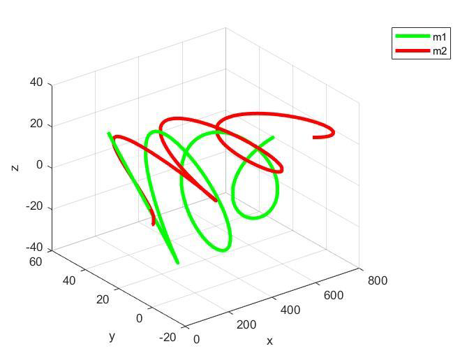
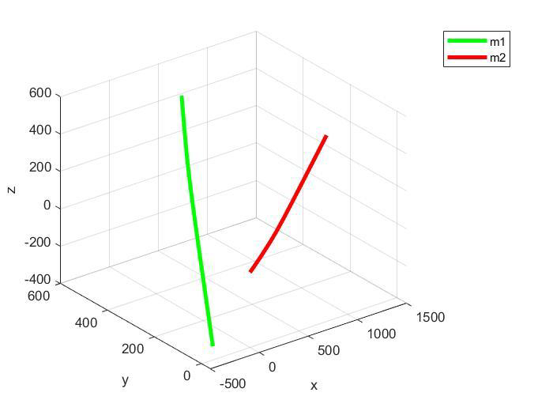

##📌 Project Overview  
This project investigates the two-body gravitational problem using numerical simulation methods.  
The aim is to solve Newton’s equations of motion for two interacting masses using the classical Runge-Kutta (RK4) method and simulate their trajectories in 2D and 3D space.  

The study includes:  
1. Derivation of governing differential equations for gravitational interaction.  
2. Implementation of RK4 method for numerical integration.  
3. MATLAB coding of the solver and visualization of particle trajectories.  
4. Analysis of orbital behavior under different initial conditions.  

---

## 🎯 Objectives  
- Derive motion equations of two bodies under Newtonian gravity.  
- Implement the Runge-Kutta 4th order method for numerical solution.  
- Compare results for different time steps and initial velocities.  
- Extend the problem from 2D to 3D dynamics.  
- Plot orbital trajectories and analyze stability.  

---

## 🛠 Tools & Software  
- MATLAB – Numerical computation and plotting.  
- Analytical Modeling – Derivation of Newtonian gravitational equations.  

---

## 📐 Methodology  

### 1. Governing Equations  
- Newton’s law of gravitation:  
  \[
  F = \frac{G m_1 m_2}{r^2}
  \]  
- Decomposition of forces in x, y, z directions.  
- Conversion to system of first-order ODEs for numerical solution.  

### 2. Numerical Method (Runge-Kutta 4th Order)  
- Implemented RK4 integration for position and velocity updates.  
- Used step size variations to test accuracy (h = 0.0001, etc.).  
- Initial conditions set for different test cases.  

### 3. MATLAB Implementation  
- Defined functions for gravitational forces in 2D and 3D.  
- Coded RK4 algorithm to propagate motion.  
- Simulated orbits for different initial velocities and distances.  

---

## 📊 Results  

- The RK4 method accurately captured orbital trajectories of the two bodies.  
- For 2D case, bodies followed elliptical orbits depending on initial velocity.  
- For 3D extension, trajectories showed realistic orbital motion in space.  
- Sensitivity to initial conditions was observed: small velocity changes altered paths significantly.  

### Simulation Outputs  
-   
-   

---

## 📂 Repository Structure

├── MATLAB/ # MATLAB codes for RK4 implementation

├── images/ # Simulation plots (2D orbit, step size, 3D orbit)

└── README.md # This file

---

## 🔬 Applications  
- Orbital mechanics and celestial dynamics.  
- Spacecraft trajectory analysis.  
- Educational use in numerical methods and dynamics courses.  
- Testing accuracy of numerical solvers for nonlinear ODEs.  

---

## 👨‍🎓 Authors  
- Mohammad Mahdi Khademi  
- Negar Naghavian
- Supervised by: Dr. Majid Rajabi  

Course: Engineering Dynamics  

---

## 📖 References  
- Newton’s Principia and standard orbital mechanics textbooks.  
- MATLAB documentation on ODE solvers.  
- Course lecture notes on numerical integration.
